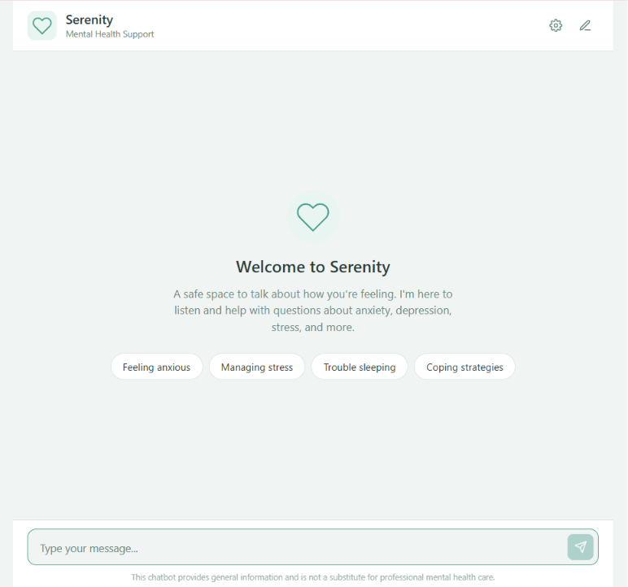
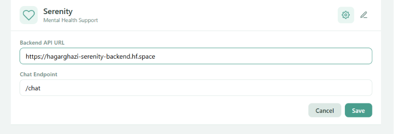
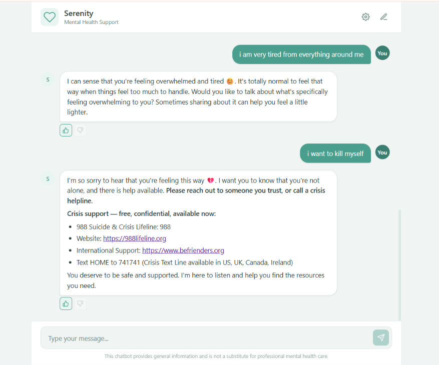
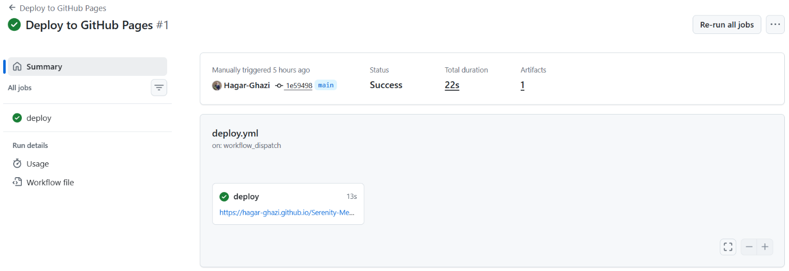

# Serenity: Mental Health Support Chatbot (Frontend)

[](https://github.com/Hagar-Ghazi/Serenity-Mental-Health-Chatbot-Frontend/actions/workflows/deploy.yml)
[](https://hagar-ghazi.github.io/Serenity-Mental-Health-Chatbot-Frontend/)

Serenity is a modern, clean and responsive web chat interface built using vanilla HTML5, CSS3 and JavaScript. It serves as an empathetic, safe and private space for users to seek support on anxiety, stress, depression and other mental health queries. The frontend connects to a containerized FastAPI backend running an intelligent NLP pipeline (classification + RAG + LLM).

---

## 🎨 User Interface & Experience Showcase

### 1. Landing Screen & Quick-Prompts
Upon opening Serenity users are welcomed with a clean card introducing the chatbot's purpose and quick-prompt chips (e.g., "Feeling anxious", "Managing stress") that allow immediate interaction.



### 2. Live API Settings Drawer
To provide flexibilty a sliding settings drawer allows developers and users to configure the backend API base URL and endpoints dynamically at runtime storing choices persistently in `localStorage`.



### 3. Empathy-Centric Conversational Flow & Safety Hotlines
The interface renders message bubbles, handles user input autosizing, displays natural typing indicators, parses markdown formatting (using `marked.js`) and logs thumbs-up/down feedback. Most importantly if crisis signs are detected it visually flags the threat and displays localized suicide and crisis helpline banners.



### 4. Automated Git CI/CD Page Deployment
Every merge or push to the `main` branch triggers an automated GitHub Actions runner that deploys the static interface straight to GitHub Pages.



---

## 🛠️ Step-by-Step Development & Integration Guide

### 1. Styling Foundations (`style.css`)
Serenity relies on a curated vanilla CSS design system designed to foster calm and safety (mint green hues, soft gray backdrops and glassmorphic elements):

- **Visual Palette**:
  tailors CSS custom properties for soft gradients (`--bg-gradient`), deep forest greens for active user text (`--primary-color`)   and comforting mint for avatars and icons.

- **Glassmorphic Settings Panel**:
  Employs absolute drawer positioning with a back-backdrop blur filter giving a premium slide-over visual experience:
  ```css
  #settings-panel {
    position: absolute;
    top: 72px; right: 0;
    width: 100%; max-width: 400px;
    background: rgba(255, 255, 255, 0.95);
    backdrop-filter: blur(10px);
    box-shadow: -4px 4px 20px rgba(0, 0, 0, 0.05);
    transition: transform 0.3s cubic-bezier(0.4, 0, 0.2, 1);
  }
  ```
- **Responsive Media Queries**:
  Fully supports mobile-first design ensuring chat inputs, bubble spacing and buttons adjust elegantly to any screen layout.


### 2. DOM Orchestration & Configurations (`app.js`)
State configurations are managed directly in browser storage to remember backend targets:
- **Storage Initialization**:
On load, it checks `localStorage` for prior settings or falls back to the default Hugging Face space endpoint:
  ```javascript
  const defaults = { apiUrl: "https://hagarghazi-serenity-backend.hf.space", endpoint: "/chat" };
  let settings = loadSettings(); // Retrieves or assigns defaults
  ```
- **Autosizing Textarea**:
  A custom listener adjusts the textarea height dynamically based on the input text length and caps it at `120px` to prevent layout collapse:
  ```javascript
  input.addEventListener("input", () => {
    input.style.height = "auto";
    input.style.height = Math.min(input.scrollHeight, 120) + "px";
  });
  ```

### 3. API Handlers & Integrations
Interaction flows are managed via asynchronous JavaScript `fetch` calls:

- **Sending Chat Message (`POST /chat`)**:
  Captures the query, hides the landing card, displays a blinking typing indicator and sends a JSON payload:
  ```javascript
  const res = await fetch(settings.apiUrl + settings.endpoint, {
    method: "POST",
    headers: { "Content-Type": "application/json" },
    body: JSON.stringify({ message: text }),
  });
  ```
  It parses the server response and handles fallback logic for status codes like `429` (Rate limits) or offline servers.

- **Submitting User Feedback (`POST /feedback`)**:
  Allows users to vote on the quality of the therapist's response. Clicking thumbs up or down sends the query text, the generated response, and the selected vote (`"up"` or `"down"`) to the backend:
  ```javascript
  async function sendFeedback(btn, userMessage, botResponse) {
    const vote = btn.dataset.vote;
    await fetch(settings.apiUrl + "/feedback", {
      method: "POST",
      headers: { "Content-Type": "application/json" },
      body: JSON.stringify({
        vote,
        user_message: userMessage,
        bot_response: botResponse,
      }),
    });
  }
  ```

---

## 🚀 Running the Frontend Locally

1. Clone your frontend repository fork:
   ```bash
   git clone https://github.com/Hagar-Ghazi/Serenity-Mental-Health-Chatbot-Frontend.git
   cd Serenity-Mental-Health-Chatbot-Frontend
   ```
2. Serve the directory using any local web server. For example using Python's built-in server:
   ```bash
   python -m http.server 8000
   ```
3. Open `http://localhost:8000` in your web browser.
4. Click the gear icon (`⚙`) in the header to open settings and configure your target API endpoint (e.g., your local API running at `http://localhost:8000`).

---

## 🔄 Automated Deployment via GitHub Actions

The repository contains an automated workflow file at **`.github/workflows/deploy.yml`**:
- **Trigger**: Every push or merge to the `main` branch.
- **Action**: Uses the official `actions/deploy-pages` and checkout actions to automatically compile and deploy the static website files (`index.html`, `style.css`, `app.js` and `assets/`) onto GitHub Pages.
- **Link**: The live web page is immediately refreshed at:
  [https://hagar-ghazi.github.io/Serenity-Mental-Health-Chatbot-Frontend/](https://hagar-ghazi.github.io/Serenity-Mental-Health-Chatbot-Frontend/)
